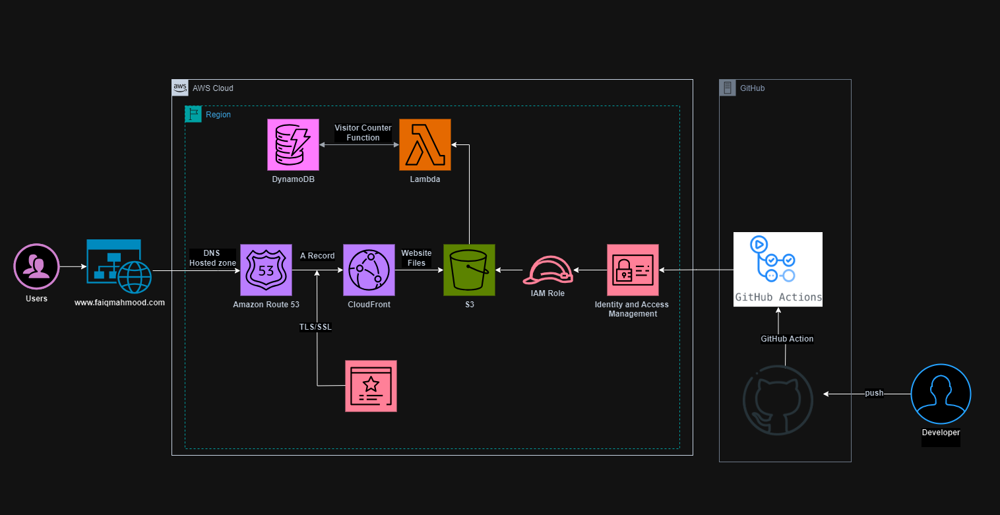

# AWS Cloud Resume Challenge Readme

## Project Description

The AWS Cloud Resume Challenge, by Forrest Brazeal, is a hands-on project designed to demonstrate proficiency in building and deploying web applications using Amazon Web Services (AWS). We creat a resume website and deploy it using various AWS services.

## Objective

The main objective of the challenge is to design, develop, and deploy a resume website utilizing AWS services like Amazon S3 for hosting static content, AWS Lambda for serverless functions, Amazon API Gateway for RESTful APIs, and Terraform for infrastructure management. The goal is to create a functional and visually appealing resume website while gaining hands-on experience with AWS technologies.

## Architecture

## Getting Started

To begin the AWS Cloud Resume Challenge, participants should follow these steps:

1. **Setup AWS Account**: Create an AWS account if not already available. The AWS Free Tier may be utilized for limited free usage of AWS services.

2. **Review Requirements**: Familiarize yourself with the requirements of the challenge as provided by Forrest Brazeal. These typically include building a resume website using HTML/CSS/JavaScript, deploying it using AWS services, and potentially automating the deployment process.

3. **Select Tools and Technologies**: Choose the tools and technologies required to build and deploy the resume website. Common choices include AWS Amplify, AWS CDK, AWS CLI, and programming languages like JavaScript or Python.

4. **Design and Development**: Develop the resume website according to the chosen design and content. Ensure the website is user-friendly, visually appealing, and contains relevant information about skills, experience, and projects.

5. **Deployment on AWS**: Deploy the website using AWS services such as Amazon S3 for hosting static content, AWS Lambda for serverless functions, Amazon API Gateway for APIs, Amazon CloudFront for speedy and scalable distribution, AWS Route 53 for DNS management and AWS CloudFormation/Terraform for infrastructure management.

6. **Automate Deployment**: Automate the deployment process using tools like AWS CodePipeline, AWS CodeBuild, or GitHub Actions to streamline the workflow.

7. **Testing and Verification**: Test the deployed website thoroughly to ensure all functionalities work as expected. Address any errors or issues encountered during the deployment process.

8. **Sharing and Networking**: Once the challenge is completed, share your experience and showcase the resume website on social media platforms or the AWS Cloud Resume Challenge community to connect with other participants and gain insights.
